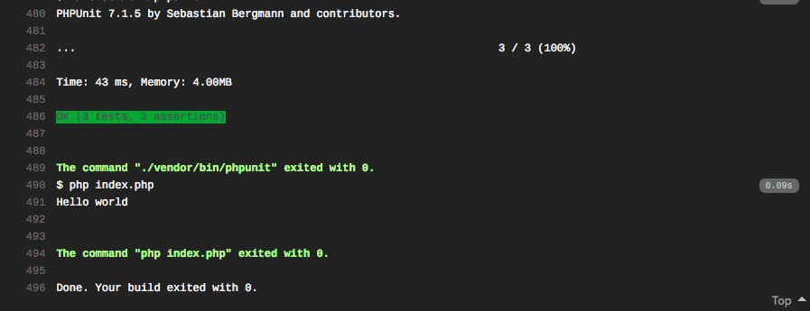
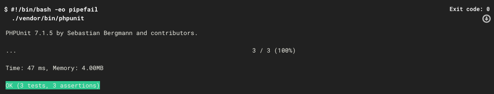

# PHP boilerplate with composer psr-4, phpunit and travis-ci.
Instead of setting up a project everytime, just fork, and clone it every time you want to start a new project.

## Create alias to quickly clone to create a new project
Put this line of code in your `.zshrc` if you are useing one then `source ~/.zshrc`
```
alias phpboil="git clone git@github.com:madeny/phpboilerplate.git $1"
```

You can change the alias as you wish!
and you can change 'Sith'  `"Sith\\": "src/"` under autoload on composer.json
then run `composer install` if you wish to install phpunit: "^7.1" or just do `composer dump-autoload -o` and start coding!

---
[](https://github.com/madeny/phpboilerplate/actions)
[](https://travis-ci.org/madeny/phpboilerplate)
[](https://circleci.com/gh/madeny/phpboilerplate)

Travis-ci


Circleci
